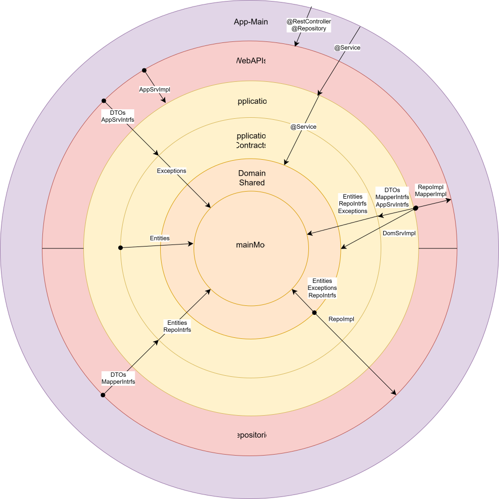

# PharmacyBack SpringBoot App

### 📌 Dependencies:  
      SpringBoot-Starters(Web, Data-JPA, Validation),  
      PostgreSQL,  
      MapStruct   

### 🌐 Front-End Module
      https://github.com/zaricu22/PharmacyFront

## 🗂️ Folder Structure
~~~
core
├── application
│   └── services
│       ├── ManufacturerAppServiceImpl.java
│       └── ProductAppServiceImpl.java
│
├── application-contracts
│   └── contracts
│       ├── dtos
│       │   ├── CreateProductDTO.java
│       │   ├── ManufacturerDTO.java
│       │   ├── ManufacturerProductsCountDTO.java
│       │   ├── ManufacturerProductsDTO.java
│       │   ├── ProductDTO.java
│       │   └── UpdateProductDTO.java
│       ├── mappers
│       │   ├── ManufacturerMapper.java
│       │   └── ProductMapper.java
│       └── services
│           ├── ManufacturerAppService.java
│           └── ProductAppService.java
│   
├── domain
│   ├── exceptions
│   │   ├── CustomArgumentException.java
│   │   ├── ErrorMessages.java
│   │   ├── ProductDateExpiredException.java
│   │   ├── ProductExistsException.java
│   │   ├── ProductNotFoundException.java
│   │   └── WrongManufacturerException.java
│   ├── model
│   │   ├── Default.java
│   │   ├── Manufacturer.java
│   │   └── Product.java
│   └── repositories
│       ├── ManufacturerRepository.java
│       └── ProductRepository.java
│
├── domain-shared
│   └── services
│       ├── ManufacturerDomainService.java
│       └── ProductDomainService.ja
│
external
├── app-main
│   └── PharmacyBackApplication.java
│
├── persistence
│   ├── mappers
│   │   ├── ManufacturerMapperImpl.java
│   │   └── ProductMapperImpl.java
│   └── repositories
│       ├── ManufacturerRepositoryImpl.java
│       └── ProductRepositoryImpl.java
│
└── webapi
    ├── controllers
    │   ├── ManufacturerController.java
    │   └── ProductController.java
    └── exceptions
        ├── ExceptionResponse.java
        └── GlobalExceptionHandler.java
~~~

## 🧱 Architecture
Domain-Driven Design via Onion/Clean 

